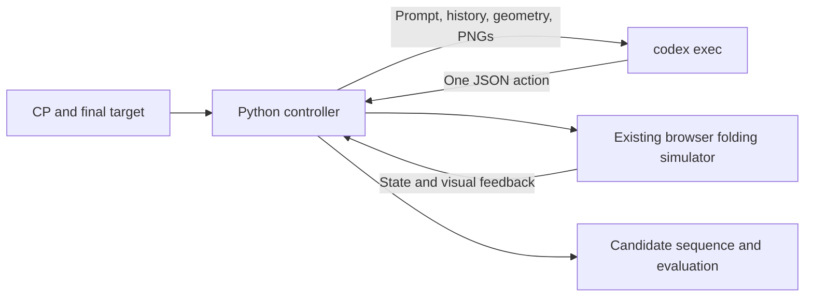

# Origami testing through the Codex CLI harness

Researched against official OpenAI documentation on September 17, 2026.

Yes: your experiment can programmatically launch the Codex CLI, receive its
response, execute a fold, and repeat. The supplied controller replaces the
Tinker sampler with `codex exec` subprocesses. It uses your existing simulator
and does not import an OpenAI SDK, call the OpenAI API directly, or require an
OpenAI API key. Codex still communicates with OpenAI's hosted service internally;
this is not offline inference.

OpenAI documents non-interactive execution from scripts, schema-constrained
responses, JSONL events, and automation using a Codex user account. This is a
documented technical route, rather than a reliance on a reported statement by
Sam Altman. It does not establish unlimited subscription usage or blanket
permission for every possible application. [Official non-interactive documentation](https://developers.openai.com/codex/noninteractive)

## Files

| File | Purpose |
| --- | --- |
| `codex_fold_loop.py` | Launches Codex, validates one action, executes it, and returns feedback |
| `codex_fold_prompt.md` | Original folding policy plus the Codex JSON response protocol |
| `run_luna_low.sh` | Full two-sample pilot with GPT-5.6 Luna, low reasoning, and all image history |
| `runs/` | Created when you run an experiment; holds artifacts and results |

The original `DHEERAJ_WORKSPACE/EXPERIMENT_SETUP/tinker_fold_loop.py` remains
unchanged. The new controller imports `capture_fold.py` and `tool_schemas.py`,
but does not import the Tinker loop or its tokenizer/renderer dependencies.

## How the loop works



For each sample, the controller initializes an empty sheet, attaches the initial
CP/target/current images, and sends the folding policy and geometry. Codex
returns exactly one action. The controller validates the action before executing
it through `BrowserSession.call`. Successful edits receive fresh images.
Subsequent prompts contain current geometry and the complete textual action
history, along with initial and latest feedback images. `finish` evaluates the
candidate; it does not imply success.

The seven actions are `add_fold`, `remove_fold`, `go_to_step`,
`restore_revision`, `get_state`, `get_images`, and `finish`. The response schema
is generated from the existing tool definitions and saved as `action.schema.json`.
These actions are returned as structured decisions. They are not registered as
native Codex tools. The CLI harness handles inference and structured output;
the outer controller handles simulator actions.

`add_fold` now uses the shared `fold-engine-layers.mjs` engine. Existing
`angle_index` actions remain valid. Alternatively, `angle_degrees` permits any
crease-line angle, using the unit normal `(-sin(theta), cos(theta))` and signed
perpendicular `offset`. The fold motion remains a flat 180-degree fold.
`selection_mode` defaults to `all`; `top` or `bottom` requires `layer_count`.
Top runs fold over, bottom runs fold under. Original-sheet connectivity is
checked before target-CP compatibility: separating a moving/stationary connection
away from the hinge returns `would-tear` without changing the session. This is
a zero-thickness geometric check, not continuous collision/contact simulation.
Saved sequences include the full line and selection for replay; edit distance
compares normalized moving half-planes, over/under, and selected runs.
The launcher still defaults to the same two all-layers corpus samples; this
change expands the available actions, not the default dataset.

Every decision uses a fresh ephemeral Codex invocation. No session ID or
`resume --last` is needed. This avoids mixing sample sessions, but historical
images are not replayed beyond the initial/latest views, and startup overhead
is paid per invocation. The Luna launcher enables `--image-history all`, which
instead reattaches every earlier feedback image, preserving the visual history.

## Full Luna low-reasoning pilot

Sol, Terra, and Astra have equivalent launchers, with the same samples, low reasoning,
40-turn budget, all image history, and logging:

```sh
bash CODEX_HARNESS_TESTING/run_sol_low.sh
bash CODEX_HARNESS_TESTING/run_terra_low.sh
bash CODEX_HARNESS_TESTING/run_astra_low.sh
```

Each accepts the same appended options as the Luna launcher, including
`--samples`, `--max-turns`, and `--timeout`. They select `gpt-5.6-sol` and
`gpt-5.6-terra`, and `gpt-6-astra`, respectively.

Run from the repository root after signing in with `codex login`:

```sh
bash CODEX_HARNESS_TESTING/run_luna_low.sh
```

This launches the same default samples as the Tinker pilot (`easy-0001` and
`easy-0002`), with 40 decisions per sample, all historical feedback images,
`--model gpt-5.6-luna`, and `model_reasoning_effort="low"`. The model and
reasoning settings are explicitly passed on every CLI invocation.
[Official model identifiers](https://developers.openai.com/codex/models),
[reasoning configuration](https://developers.openai.com/codex/config-reference).

To change samples or budgets, append options:

```sh
bash CODEX_HARNESS_TESTING/run_luna_low.sh --samples easy-0001 --max-turns 60
```

Equivalent Python command:

```sh
.venv/bin/python CODEX_HARNESS_TESTING/codex_fold_loop.py \
  --samples easy-0001 easy-0002 --max-turns 40 --timeout 300 \
  --model gpt-5.6-luna --reasoning-effort low --image-history all
```

Logging is enabled automatically using the existing Tinker observability core.
The run root now includes `events.jsonl`, `transcripts.jsonl`, `metrics.jsonl`,
and `episodes/`, in addition to the complete per-turn CLI logs and PNG artifacts.
CLI-reported token usage and exposed reasoning summaries are normalized into
the transcripts; private reasoning and unavailable usage fields are not invented.
All model launchers default to full terminal output (`OBS_ECHO=full`); set
`OBS_ECHO=preview` or `OBS_ECHO=off` to reduce it. Each Codex invocation requests
`model_reasoning_summary="detailed"`, forces reasoning metadata on with
`model_supports_reasoning_summaries=true`, and sets `hide_agent_reasoning=false`
and `show_raw_agent_reasoning=true`. These settings request and surface reasoning
that the model/backend exposes; they cannot force access to private reasoning
or guarantee a longer summary. Reasoning effort remains unchanged.
[Official configuration reference](https://developers.openai.com/codex/config-reference).

Read the newest run using the existing viewer:

```sh
.venv/bin/python DHEERAJ_WORKSPACE/EXPERIMENT_SETUP/observability/view_trace.py \
  --roots CODEX_HARNESS_TESTING/runs --follow
```

You can compare both run roots in the existing interactive viewer:

```sh
.venv/bin/python DHEERAJ_WORKSPACE/EXPERIMENT_SETUP/observability/view_trace_tui.py \
  --roots CODEX_HARNESS_TESTING/runs DHEERAJ_WORKSPACE/EXPERIMENT_SETUP/runs
```

Earlier Tinker runs already use this trace format and require no import.
All-history image input grows with each rendered turn and can hit the service's
image/context limits. Such failures are logged and stop the batch. Use
`--image-history latest` if you deliberately want a smaller visual context.
The new launcher and trace integration have been inspected, but not run.

## Account authentication and installation

Run these commands yourself from the repository root. They have not been run
by the assistant.

If Codex is already installed:

```sh
codex --version
codex exec --help
codex login
codex login status
```

Complete the browser flow with your ChatGPT account. OpenAI documents ChatGPT
sign-in for subscription access and API-key sign-in for usage-based access.
This experiment explicitly selects ChatGPT authentication. An eligible account
and available Codex usage are still required. [Official authentication documentation](https://developers.openai.com/codex/auth)

If you need to install the CLI on macOS, the CLI documentation provides
installation guidance; a Homebrew installation avoids a Node-based installer:

```sh
brew install --cask codex
```

[Official Codex CLI documentation](https://developers.openai.com/codex/cli)

The controller removes `OPENAI_API_KEY`, `CODEX_API_KEY`, and `OPENAI_BASE_URL`
from the child process environment, selects the OpenAI provider, and sets
`forced_login_method="chatgpt"`. A cached API-key login is not sufficient;
sign in with your ChatGPT account. Do not copy authentication files into this
folder or run artifacts.

The existing experiment's Playwright, Chromium, and Pillow are still needed
for the simulator and PNG preparation. No Tinker dependencies are needed for
this new loop. If your existing `.venv` already runs the folding renderer,
reuse it. If those rendering dependencies are missing, you can run:

```sh
.venv/bin/python -m pip install playwright Pillow
.venv/bin/python -m playwright install chromium
```

## Run a small test first

```sh
.venv/bin/python CODEX_HARNESS_TESTING/codex_fold_loop.py \
  --samples easy-0001 \
  --max-turns 2 \
  --timeout 300
```

This checks CLI login, image input, output schema, simulator integration, and
trace generation. A two-turn episode may stop with `turn_budget`; that is an
expected smoke-test outcome, not evidence of failure to integrate.

Then run the two-sample pilot:

```sh
.venv/bin/python CODEX_HARNESS_TESTING/codex_fold_loop.py \
  --samples easy-0001 easy-0002 \
  --max-turns 40 \
  --timeout 300
```

The model defaults to the one selected by your installed CLI/configuration.
To select an available model explicitly, add `--model MODEL_ID`, replacing
`MODEL_ID` with the actual model identifier supported by your account. Record
the CLI version and model when comparing experiments. No specific subscription
model availability is assumed here.

Useful options are `--corpus`, `--out`, `--prompt`, `--codex-bin`,
`--render-size`, `--max-image-edge`, and `--max-image-bytes`. The default corpus
is the same all-layers release corpus used by the original loop.

## What the subprocess runs

Conceptually, each turn uses the following command. The controller supplies
absolute schema/output/image paths and passes the prompt on stdin:

```sh
codex -a never exec \
  --sandbox read-only \
  --skip-git-repo-check \
  --ephemeral \
  --json \
  -C /path/to/temporary/empty-directory \
  -c 'forced_login_method="chatgpt"' \
  -c 'model_provider="openai"' \
  -c 'features.shell_tool=false' \
  -c 'features.unified_exec=false' \
  -c 'web_search="disabled"' \
  --output-schema /absolute/path/action.schema.json \
  --output-last-message /absolute/path/response.json \
  --image /absolute/path/view.png \
  - < /absolute/path/prompt.md
```

The CLI reference documents stdin prompts, image attachments, sandbox and
approval options, ephemeral execution, and final-message output. Check
`codex exec --help` against your installed version if a flag is rejected.
[Official CLI reference](https://developers.openai.com/codex/cli/reference)

The configuration reference documents authentication restrictions, provider
selection, shell feature toggles, and web-search configuration.
[Official configuration reference](https://developers.openai.com/codex/config-reference)

## Outputs and interpretation

Model-facing numeric geometry/history and terminal tool previews are rounded
to 10 decimal places. For example, `0.25000000000000017` is displayed as `0.25`.
This only changes presentation: the simulator, executed actions, candidate
files, evaluator, and raw `tool.json`/`history.json` retain their original values.
Each executed turn also saves `model-feedback.json` with the cleaned feedback.
The run configuration records `model_geometry_decimals`. This suppresses
irrelevant decimal noise; it does not repair incorrect folds or change tolerances.

The script prints its run directory, for example
`CODEX_HARNESS_TESTING/runs/codex-<timestamp>/`. Each sample contains:

- `seq.json`, `steps.fold`, and `final.fold`: the current accepted candidate.
- `cp.fold` and `target.fold`: the whitelisted task geometry.
- `initial/` and `final/`: rendered PNGs and image manifests.
- `turn-XXX/prompt.md`, `command.json`, and `images.json`: exact controller inputs.
- `turn-XXX/events.jsonl`, `stderr.log`, `process.json`, and `response.json`: CLI output and process status.
- `turn-XXX/tool.json` and `feedback-images/`: simulator feedback.
- `history.json` and `result.json`: action history and episode outcome.

The run root also contains `config.json`, the prompt snapshot, `tools.json`,
`action.schema.json`, and `results.json`.

The matching evaluator and action-edit-distance tolerance follow the original
pilot, except that `terminal_reference_match` now compares the final layer stack
up to a plane isometry: any translation or rotation angle counts. Turning the
model over reflects its geometry, reverses the bottom-to-top layer order, and
flips every face parity. A coordinate-only mirror with unchanged order/parity
does not represent a turnover. Every layer must match under one shared
transformation. Original-sheet face identity is not checked by this metric.
Initial inputs include an exploded target view; successful edits produce an
exploded current-state view for the next decision, alongside the existing views.
Older runs retain their saved scores until explicitly re-scored with
`node workspace/rescore_runs.mjs`.

`solved` requires both a `finish` action and `pilot_match`. The reference
`seq.json` is read only after the last Codex invocation for scoring; reference
actions are never inserted into the prompt. Accepted actions are saved after
each simulator call, so a later CLI error leaves the candidate available.

Errors stop the batch and return a nonzero exit status. Read the sample's
`error.json` and the last turn's `stderr.log`. Authentication failures, quota
limits, unsupported models, timeouts, and rejected CLI flags are not automatically
retried. Invalid JSON actions receive corrective feedback without simulator
execution. Repeating the same action in the same complete state more than
three times stops the episode.

## Limits of this comparison

This tests fold recovery using the real Codex CLI entry point. It does not
reproduce the Tinker sampling setup exactly: Codex supplies its own harness
instructions, and there is no direct equivalent here for Tinker's temperature,
seed, output-token budget, tokenizer, or full thinking traces. `--max-turns`
counts outer CLI decisions, not the harness's internal model turns. The timeout
limits wall-clock duration per CLI process. The full textual history grows
with the episode; context overflow is reported as an error rather than handled
by a custom token counter.

CLI JSONL logs may expose usage or reasoning summaries, depending on version
and model. The script retains them without claiming access to private reasoning
or converting subscription usage into Tinker-style dollar estimates.

Codex runs from an empty directory outside the repository and shell/web search
are disabled. This reduces accidental reference leakage but is not a hermetic
filesystem boundary. User-level Codex instructions, configuration, configured
MCP servers, plugins, and other enabled features may still affect the harness.
Use an account/configuration without extra tools or task-specific knowledge for
a controlled benchmark; do not assume the read-only sandbox prohibits reads.

If you later want Codex to own the full multi-action tool loop in one persistent
session, expose the folding operations through MCP and use CLI/App Server
integration. That is a different experiment architecture. The supplied version
keeps action execution and budgets under the same kind of outer-loop control
as your Tinker pilot.

No install, Python/Node command, simulator startup, login, or Codex inference
was executed while preparing these files. The implementation has been inspected
statically; runtime validation remains for you to perform with the commands above.
